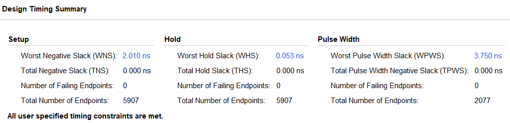

# 设计优化说明

> 无 76	RainEggplant	2017\*\*\*\*\*\*

如下图，WNS 为 2.010 ns。因此得该 CPU 理论工作频率约为 125.16 MHz。 

##  优化思路

### 平衡流水线各段用时

按照理论课上的内容，EX 阶段的转发工作流程是：

> 在 EX 阶段判断当前使用的寄存器是否为上条或上上条指令的目的写入寄存器，产生多选器的选择信号，选出最新的寄存器值。

但是可以看到这样做的话，当时钟上升沿来临时，会先有这一个判断过程，然后才能得到最新的寄存器值。

于是我们提出猜想，如果 ID 阶段的时间较宽裕，是否就可以把判断提前到 ID 来做，然后把生成的多选器选择信号直接传给 ID/EX 流水线寄存器。这样，EX 阶段获取最新寄存器的值就无需经过判断过程了。

按照该思路修改代码（commit ID: `8383b1891bc77f03fda24e58b94e554392c0b77a`），发现时序得到了很大的优化。

类似地，按照理论课的模型，WB 阶段会先根据 `mem_wb.MemToReg` 信号选择 `mem_wb.alu_out`, `mem_wb.mem_out` 或 `mem_wb.pc_next` 之一，然后再写入寄存器。但是为什么不试试让 MEM 阶段即做好判断，把要写入寄存器的数据直接选出来传给 MEM/WB 流水线寄存器呢？这样不仅省了 WB 阶段的时间，还节省了流水线寄存器的空间。

按照该思路修改代码，发现时序的确得到不小的改善。

### 精简代码，减少资源占用

代码层面来讲就是精简控制信号，精简寄存器使用，精简逻辑。这样最后综合/实现出来资源使用得少，时序裕量自然就相对较高。

### 使用硬件串口

这项优化非常不本质，但是可能有一定的效果。

首先是在排序数据空间占用上的优势。如果不使用串口传入 100 个随机数，不管是把它们编译在比特流中，还是使用 ROM IP，都一定会占用一定的空间。

然后是在汇编程序长度上的优势。串口可以直接将随机数传入 `DataMemory`, 而采用其他的方式还需要通过指令将其读入 `DataMemory`。排序完成后，程序可以直接将 `DataMemory` 中数据通过串口输出，而其他方式必须通过指令控制数码管外设。从而，其他方式的汇编程序长度将更长，会占用更多空间。

当占用空间过多时，会增加布线的长度，从而增加延迟。

### 设置合适的 Vivado 的 Synthesis 及 Implementation 策略

Vivado 有很多的 Synthesis 及 Implementation 策略。采用不同的策略，经过综合、实现后得出的裕量差别非常大。因此，选择与代码合适的策略、以及根据策略调整代码是非常重要的。

举个例子，本项目的某个版本采用综合策略 `Vivado Synthesis Defaults (Vivado Synthesis 2018)` 和实现策略 `Performance_ExtraTimingOpt (Vivado Implementation 2018)` 得出的裕量为 `1.773` ns。后来略微修改代码后，采用同样的策略，裕量居然降到了 `1.4` ns。但是，更换综合策略为 `Flow_AlternateRoutability  (Vivado Synthesis 2018)` 后，裕量又达到了 `2.010` ns 。

上面的经历让我当时觉得 Vivado 实在是有点玄学。但是后来一想，还是由于自己对于 FPGA 底层实现的理解太粗浅了。我猜想，一个有着丰富 FPGA 开发经验的工程师，一定能够通过设定非常细节但精确的约束，来影响综合与实现，从而得到最好的结果。无奈自己经验不足，也只能望洋兴叹了。

## 供验证工程

所有工程文件位于 `mips_pipeline_cpu` 下。要在 Vivado 2018.3 中自动建立该工程，只需要执行 `Tools -> Run Tcl Script...` ，选择 `mips_pipeline_cpu.tcl`。然后工程会自动生成在该目录的子文件夹 `vivado_project` 中。更多信息请查看 `README.md`。

注：基于上一节的原因，请验证时保证 Synthesis 及 Implementation 策略与上一节一致。

