# 流水线 MIPS 处理器实验报告

> 无 76	RainEggplant	2017\*\*\*\*\*\*


## 实验目的

1. 加深对现代处理器的基本工作原理的理解；
2. 掌握流水线处理器的设计方法。


## 设计方案

### 项目组成

**该项目分为如下部分：**

1. CPU 与主存

   该部分包括流水线 CPU 的功能模块以及指令、数据存储器。

2. 总线和外部设备

   该部分包含总线和一系列外设（中断定时器、七段数码管、系统时钟计数器、LED 和串口）。


### 功能与特性

**本项目的流水线 MIPS CPU 具有如下功能与特性：**

1. 125+ MHz 主频
2. 5 级流水线 (IF, ID, EX, MEM, WB)
3. Forwarding 支持
   - 采用完全的 forwarding 电路解决数据关联问题
   - 对于 load-use 类竞争采取阻塞一个周期 + forwarding 的方法解决 
4. 分支与跳转 （未采用延迟槽）
   - 分支指令在 EX 阶段判断，分支发生时取消 IF 和 ID 阶段的两条指令 
   -  J 类指令在 ID 阶段判断，并取消 IF 阶段指令。
5. 支持 30 条 MIPS 指令
   - 存储访问指令： lw, sw
   - 算术指令： add, addu, sub, subu, addi, addiu, lui
   - 逻辑指令： and, or, xor, nor, andi, ori, sll, srl, sra, slt, slti, sltiu 
   - 分支和跳转指令: beq, bne, blez, bgtz, bltz 和 j, jal, jr, jalr 
6. 支持简单的异常（未定义指令异常）和中断的处理 
7. 1 Kbyte 指令存储器，1 Kbyte 数据存储器（当然可以通过修改参数变得很大）
8. 支持通过伪总线与外设交互（之所以叫伪总线，是因为只是借鉴总线思想，实际实现并不符合总线规范）
   - 控制七段数码管
   - 控制 LED 灯
   - 配置中断定时器、响应其中断
   - 获取系统时刻
   - 使用串口导入指令与数据，导出数据


### 数据通路图

下图为本项目的数据通路图。由于版面限制，部分控制信号与细节未绘出。

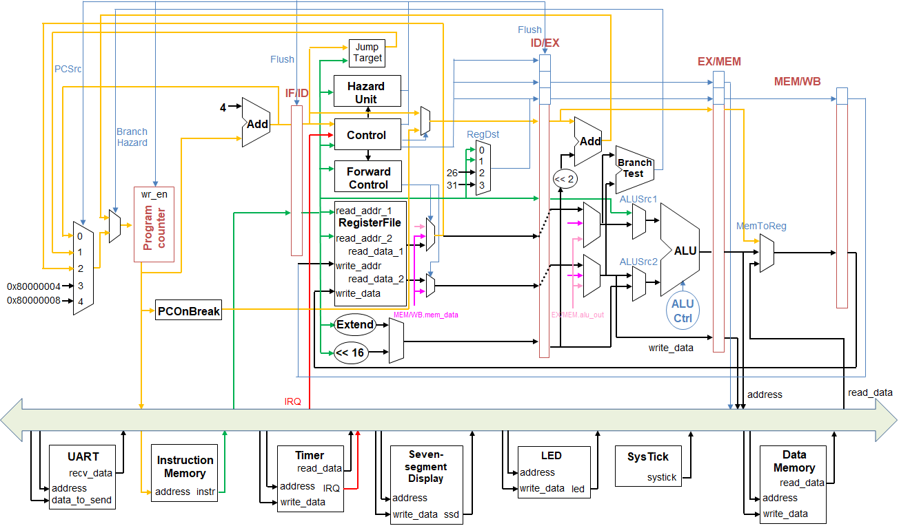


## 原理详述与关键代码

本节将对照数据通路图与代码，详述本项目的关键原理与代码实现。

请注意：为了代码的简洁，本工程的所有流水线寄存器都没有定义输出端口，而通过操作符 `.` 访问其数据。 例如 `id_ex.MemWrite`。


### 转发 (Forwarding)

本 CPU 中的 forwarding 电路围绕模块 `ForwardControl` 实现。该模块的作用是当检测到数据冒险时，输出转发选择信号。

分析 CPU 中的转发路径（需要阻塞的情况将在后面考虑）：

- ID 阶段的 `jr` , `jalr` 需要使用到 `rs` 寄存器，因此需要有来自 EX/MEM, MEM/WB 的转发。
- 为了模拟寄存器堆 ”先写后读“ 的要求，ID 阶段的`rd` 也还需要来自 MEM/WB 的转发。
- EX 阶段需要来自 EX/MEM, MEM/WB 的转发。


下图是转发电路，注意有两次转发，第一次在 ID 阶段，第二次在 EX 阶段。

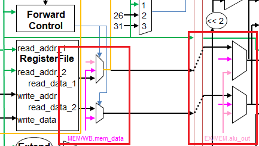


这里有一个可以优化时序性能的地方：EX 阶段的转发信号可以在 ID 阶段提前生成。因为 ID 阶段的时间相对宽裕，把这部分逻辑提前就能起到缩短 EX 阶段路径长度的作用。


相关逻辑部分的代码见下：

> src/designs/cpu/ForwardControl.v

```verilog
always @ (*)
  begin
    if (~reset)
      begin
        // Forwarding for ID stage
        if (
          ex_mem_RegWrite
          && (ex_mem_write_addr != 0)
          && (ex_mem_write_addr == rs_addr)
        )
          ForwardA_ID = 2'b10;
        else if (
          mem_wb_RegWrite
          && (mem_wb_write_addr != 0)
          && (mem_wb_write_addr == rs_addr)
        )
          ForwardA_ID = 2'b01;
        else
          ForwardA_ID = 2'b00;

        // There is no need to forward for rt from ex_mem during ID,
        // because that will be done in EX
        if (
          mem_wb_RegWrite
          && (mem_wb_write_addr != 0)
          && (mem_wb_write_addr == rt_addr)
        )
          ForwardB_ID = 1;
        else
          ForwardB_ID = 0;

        // Forwarding for EX stage
        if (
          id_ex_RegWrite
          && (id_ex_write_addr != 0)
          && (id_ex_write_addr == rs_addr)
        )
          ForwardA_EX = 2'b10;
        else if (
          ex_mem_RegWrite
          && (ex_mem_write_addr != 0)
          && (ex_mem_write_addr == rs_addr)
        )
          ForwardA_EX = 2'b01;
        else
          ForwardA_EX = 2'b00;

        if (
          id_ex_RegWrite
          && (id_ex_write_addr != 0)
          && (id_ex_write_addr == rt_addr)
        )
          ForwardB_EX = 2'b10;
        else if (
          ex_mem_RegWrite
          && (ex_mem_write_addr != 0)
          && (ex_mem_write_addr == rt_addr)
        )
          ForwardB_EX = 2'b01;
        else
          ForwardB_EX = 2'b00;

      end
    else
      begin
        ForwardA_ID = 2'b00;
        ForwardB_ID = 0;
        ForwardA_EX = 2'b00;
        ForwardB_EX = 2'b00;
      end
  end
```


 ### 冒险 (Hazard)

本项目中需要解决的冒险为 数据冒险和控制冒险（此处不讨论已通过转发消除的冒险，中断和异常带来的冒险将在下一节讨论）。

#### 数据冒险

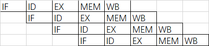

分析数据冒险的情况如下：

- 处于 EX 阶段的指令需要用到前一条指令的 MEM 阶段的结果
- 处于 ID 阶段的指令需要用到前一条指令的 EX 或 MEM 阶段的结果
- 处于 ID 阶段的指令需要用到前第二条指令的 MEM 阶段的结果


这部分的判断由模块 `HazardUnit` 完成，相应的控制信号为 `DataHazard`。相关逻辑部分的代码如下：

> src/designs/cpu/HazardUnit.v

```verilog
wire last =
     id_ex_write_addr != 0 &&
     (if_id_rs_addr == id_ex_write_addr || if_id_rt_addr == id_ex_write_addr);
wire second_last =
     ex_mem_write_addr != 0 &&
     (if_id_rs_addr == ex_mem_write_addr || if_id_rt_addr == ex_mem_write_addr);
wire lw = id_ex_MemRead && last;
wire jr =
     JumpReg && // Jump Register instr
     // the last instr will write to source reg (stall 1 & forward from EX needed)
     ((id_ex_RegWrite && last) ||
      // the second last instr will load data to source reg (stall 1 & forward from MEM needed)
      (ex_mem_MemRead && second_last)
      // and if the last instr will load data to source reg, the variable `lw` will handle it
     );

assign DataHazard = lw || jr;
```


#### 控制冒险

控制冒险的产生分为以下两种情况：

- 跳转语句和成功的分支语句
- 异常或中断（在下一节讨论）

我们定义了 `JumpHazard` 和 `BranchHazard` 信号来区分跳转与分支，相关信号由 `Control` 和 `BranchTest` 模块生成。对应文件为：

> src/designs/cpu/Control.v

> src/designs/cpu/BranchTest.v

此部分代码列出意义不大。`Control` 模块会在遇到跳转指令时将 `JumpHazard` 置 `1`, `BranchTest` 模块的功能是在分支指令的 EX 阶段检查分支条件是否成立，若成立则置 `BranchHazard` 为 `1`。


#### 冒险的处理

对冒险进行分析，有如下几种情况：

- 当 `DataHazard` 发生时，需要禁止 PC 和 IF/ID 流水线寄存器的写入。
- 当 `JumpHazard` 发生时，需要 Flush 掉 IF/ID 流水线寄存器。
- 当 `BranchHazard` 发生时，需要 Flush 掉 IF/ID, ID/EX 流水线寄存器。

相关的代码见下一节。


### 中断与异常

本项目定义的中断有 “定时器中断”，支持的异常有 “未定义指令异常”。

当 CPU 处于内核态时，新的中断与异常不被响应，因此设定了监督位 `Supervised = pc[31] || if_id.pc_next[31]`（`if_id.pc_next[31]` 对应从内核态切换回用户态时阻塞的一个周期）。`Supervised` 为 `1` 即表明 CPU 处于内核态。

`Control` 模块在 ID 阶段检测异常，响应中断。当 CPU 不为内核态时，具体的操作是：

- 发生中断或异常时，无条件地将 `Branch`, `MemRead`, `MemWrite` 信号置 `0`, `RegWrite` 信号置 `1` , `MemToReg` 信号置 `2'b10` (对应`pc_next`),  `RegDst` 信号置 `2'b11`  (对应`$k0`)。即把当前指令更改为将 `pc_next` 写入 `$k0` 寄存器。
- 若发生中断，置 `PCSrc` 信号为 `3'b011` ; 若发生异常，置 `PCSrc` 信号为 `3'b100`。
- 置 `ExceptionOrInterrupt` 信号为 `1`, 以允许 PC, IF/ID 流水线寄存器被写入（否则可能被 `DataHazard` 信号禁止），Flush 掉 IF/ID 流水线寄存器。
- `ExceptionOrInterrupt` 信号为 `1` 时，向后传入的 `pc_next` 信号由模块 `PCOnBreak` 提供（这是为了保证当中断发生在分支或跳转指令的 stall 区间时，还能正确返回到该分支或跳转语句。


下图是涉及到控制冒险、中断与异常处理的电路：

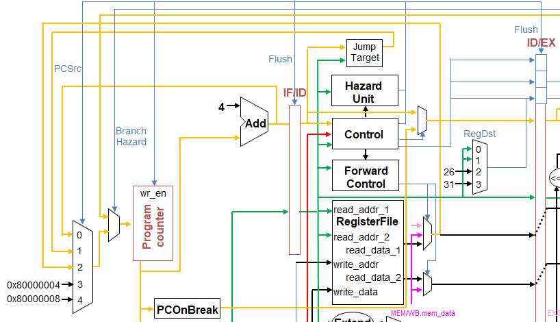


涉及对 PC, IF/ID, ID/EX 流水线寄存器操作的代码如下：

> src/designs/cpu/CPU.v

```verilog
// ...
ProgramCounter program_counter(
                 .clk(clk), .reset(reset), .wr_en(~DataHazard || ExceptionOrInterrupt),
                 .pc_next(pc_next), .pc(pc)
               );

// ...
IF_ID_Reg if_id(
            .clk(clk), .reset(reset), .wr_en(~DataHazard || ExceptionOrInterrupt),
            .Flush(ExceptionOrInterrupt || JumpHazard || BranchHazard),
            .instr_in(instruction), .pc_next_in(pc_plus_4)
          );

// ...
ID_EX_Reg id_ex(
            .clk(clk), .reset(reset), .Flush(DataHazard || BranchHazard),
            .shamt_in(if_id.instr[10:6]), .funct_in(if_id.instr[5:0]), 
    		.write_addr_in(write_addr),
            .rs_in(latest_rs_id), .rt_in(latest_rt_id), .imm_in(imm_out),
            .pc_next_in(ExceptionOrInterrupt ? pc_on_break : if_id.pc_next),
            .Branch_in(Branch), .BranchOp_in(BranchOp), .ALUOp_in(ALUOp), 
    		.ALUSrc1_in(ALUSrc1), .ALUSrc2_in(ALUSrc2),
            .ForwardA_EX_in(ForwardA_EX), .ForwardB_EX_in(ForwardB_EX),
            .MemRead_in(MemRead),	.MemWrite_in(MemWrite),
            .MemToReg_in(MemToReg), .RegWrite_in(RegWrite)
          );
```


涉及中断或异常时控制信号的生成的代码位于：

> src/designs/cpu/Control.v

此处不再贴出。


### CPU 各级流水线

建议配合前面的 [数据通路图](#数据通路图) 和下述文件中的代码阅读。

> src/designs/cpu/CPU.v

#### IF 级

IF 级包含通过总线获取指令、更新 PC 、写入 IF/ID 流水线寄存器的操作。

#### ID 级

ID 级包含控制信号、转发信号、中断与异常控制信号的生成，冒险的检测、跳转指令的控制，以及寄存器堆的读取、立即数的扩展和 ID/EX 流水线寄存器的写入。

#### EX 级

EX 级包含 ALU 运算，分支指令的判断与控制，以及 EX/MEM 流水线寄存器的写入。

#### MEM 级

MEM 级包含通过总线写入或读取内存或外设中的数据，以及写入 MEM/WB 流水线寄存器。

#### WB 级

 WB 级包含对寄存器堆的写入操作。

#### 流水线寄存器

> src/designs/cpu/pipeline_registers/*.v

MIPS 的五级流水线使用四个流水线寄存器来存放数据和控制信号。


### （伪）总线

> src/designs/cpu/Bus.v

 总线管理了指令存储器、数据存储器以及众多外设，负责根据 CPU 的控制信号对指定硬件进行读写操作。


### 外设

#### 中断定时器

> src/designs/external_devices/Timer.v

| 地址范围   | 功能               | 备注                                                         |
| ---------- | ------------------ | ------------------------------------------------------------ |
| 0x40000000 | 定时器 `TH`        | 每当 `TL` 计数到全 `1` 时，自动加载 `TH` 值到 `TL`           |
| 0x40000004 | 定时器 `TL`        | 定时器计数器， `TL` 值随时钟递增                             |
| 0x40000008 | 定时器控制 `TCON ` | 0bit：定时器使能控制， 1-enable， 0-disable<br />1bit：定时器中断控制， 1-enable， 0-disable<br />2bit：定时器中断状态，中断控制启用时，计数到全 `1` 会将本位置 `1` |


#### LED

> src/designs/external_devices/LED.v

| 地址范围（字节地址） | 功能     | 备注         |
| -------------------- | -------- | ------------ |
| 0x4000000C           | 外部 LED | 仅低 8 位有效，对应开发板上 8 个 LED 灯 |


#### 七段数码管

> src/designs/external_devices/SSD.v

| 地址范围（字节地址） | 功能       | 备注                                           |
| -------------------- | ---------- | ---------------------------------------------- |
| 0x40000010           | 七段数码管 | 0-7 bit 是数码管控制，8-11 bit 是 4 个阳极控制 |


#### 系统时钟计数器 

> src/designs/external_devices/SysTick.v

| 地址范围（字节地址） | 功能           | 备注                                                         |
| -------------------- | -------------- | ------------------------------------------------------------ |
| 0x40000014           | 系统时钟计数器 | 系统复位时， `systick` 复位为零，之后每系统时钟周期，计数值加`1`。忽略溢出 |


#### 串口（硬件控制）

> - src/designs/external_devices/UART.v
> - src/designs/external_devices/UART_Rx.v
> - src/designs/external_devices/UART_Tx.v

后两个文件来自上学期的实验三。

串口模块的定义如下：

```verilog
module UART(
         clk, en, mode, ram_id, Rx_Serial, data_to_send,
         addr, on_received, recv_data, Tx_Serial,
         IM_Done, DM_Done
       );
```

| 端口         | 类型          | 备注                                     |
| ------------ | ------------- | ---------------------------------------- |
| en           | input         | 串口是否启用                             |
| mode         | input         | 0: 接收，1: 发送（仅对数据存储器有效）   |
| ram_id       | input         | 0: 指令存储器，1: 数据存储器             |
| Rx_Serial    | input         | 串口接收序列                             |
| data_to_send | input [31:0]  | 要发送的数据（自动控制）                 |
| addr         | output [31:0] | 指令存储器和数据存储器的地址（自动控制） |
| on_received  | output        | 接收到一个字的时候产生一个周期的高电平   |
| recv_data    | output [31:0] | 接收到的一个字                           |
| Tx_Serial    | output        | 串口发送序列                             |
| IM_Done      | output        | 指令存储器接收满                         |
| DM_Done      | output        | 数据存储器接收满/发送完毕                |


串口对 CPU 不可见，采用硬件方式控制。要使用串口模块，需要先停止 CPU （即置 `reset` 为 `1`），然后打开串口（`en` 置 `1`）。支持的操作如下：

| 操作     | mode | ram_id |
| -------- | ---- | ------ |
| 接收指令 | 0    | 0      |
| 接收数据 | 0    | 1      |
| 发送数据 | 1    | 1      |


接收完数据后，关闭串口并启动 CPU（即置 `en` 为 `0`，`reset` 为 `0`），自动开始执行指令。


## 仿真测试

本工程下共有 5 个 simulation set, 分别是

| 名称                  | 备注                                                         |
| --------------------- | ------------------------------------------------------------ |
| cpu_tb                | 测试 CPU 的基本功能和定时器中断。汇编指令由上学期实验四修改得来。<br />代码文件：`timer.s`（汇编指令）, `timer.hex`（十六进制机器码文本） |
| cpu_with_uart_tb      | 主要用于测试串口的收发功能。<br />代码文件：`uart.s`, `uart.hex`, `uart_data.hex`（十六进制数据文件） |
| cpu_tb_insertion_sort | 测试本次实验要求的排序代码。<br />代码文件：`insertion_sort.s`, `insertion_sort.hex`, `insertion_sort_data.hex` |
| data_memory_tb        | 测试数据存储器                                               |
| register_file_tb      | 测试寄存器堆                                                 |

下面展示第一项和第三项测试。


### CPU 基本功能及定时器中断测试

测试的汇编指令如下：

> src/testbenches/assembly/timer.s

```assembly
        j       to_kuseg
        j       interrupt
        j       exception

to_kuseg:
        la      $ra,    main
        jr      $ra

main:
        # enable timer
        lui     $t1,    0x4000
        lui     $t2,    0xffff
        ori     $t2,    $t2,    0xffcf
        sw      $t2,    0($t1)
        sw      $t2,    4($t1)
        ori     $t3,    $zero,  3
        sw      $t3,    8($t1)

        addi    $a0,    $zero,  3
        jal     sum

loop:
        beq     $zero,  $zero,  loop

sum:
        addi    $sp,    $sp,    -8
        sw      $ra,    4($sp)
        sw      $a0,    0($sp)
        slti    $t0,    $a0,    1
        beq     $t0,    $zero,  L1
        xor     $v0,    $zero,  $zero
        addi    $sp,    $sp,    8
        jr      $ra

L1:
        addi    $a0,    $a0,    -1
        jal     sum
        lw      $a0,    0($sp)
        lw      $ra,    4($sp)
        addi    $sp,    $sp,    8
        add     $v0,    $a0,    $v0
        jr      $ra

interrupt:
        sw      $t1,    -4($sp)
        sw      $t2,    -8($sp)
        lui     $t1,    0x4000
        ori     $t2,    $zero, 3
        sw      $t2,    8($t1)
        lw      $t1,    -4($sp)
        lw      $t2,    -8($sp)
        jr      $k0

exception:
        beq     $zero,  $zero,  exception

```


仿真结果如图：

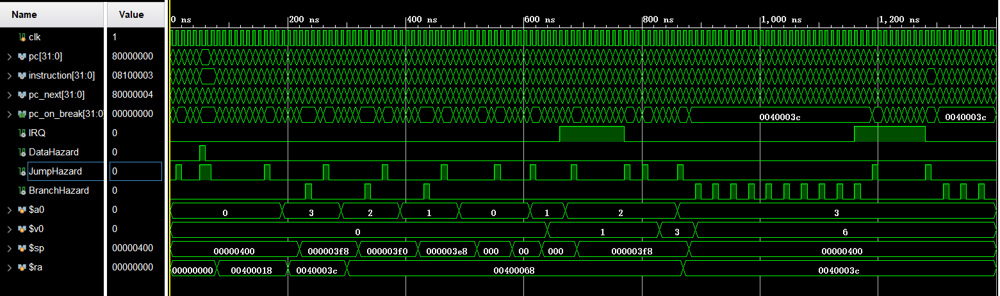

对照上学期的实验四，发现程序正常运行，得到了正确的结果。

同时，CPU 也正确地处理了两次定时器中断。


### 本实验排序代码测试

我选择了插入排序作为本次实验的排序方法。

测试的代码如下：

> src/testbenches/assembly/insertion_sort.s

```assembly
.text
        j       to_kuseg
        j       interrupt
        j       exception

to_kuseg:
        la      $ra,    main
        jr      $ra

main:
        li      $s5,    0x40000014
        lw      $s6,    0($s5)          # load `systick`
        # use insertion sort on array `v` with `n` numbers
        # $s0: i, $s1: j,  $s2: v, $s3: n
        li      $s2,    0               # v = 0x00000000        
        li      $s3,    100             # n = 100
        
        # for_outer (i = 0; i < n; ++i)
        li      $s0,    0               # i = 0
for_outer:
        # if (!(i < n)) end for
        slt     $t0,    $s0,    $s3
        beq     $t0,    $zero,  endf_outer
        
        # for_inner (j = i - 1; j >= 0 && v[j] > v[j + 1]; --j)
        addi    $s1,    $s0,    -1      # j = i - 1
for_inner:
        # if (j < 0) end for
        slti    $t0,    $s1,    0
        bne     $t0,    $zero,  endf_inner
        # if (!(v[j] > v[j + 1])) end for
        sll     $t0,    $s1,    2
        add     $t1,    $s2,    $t0
        lw      $t2,    0($t1)          # $t2 = v[j]
        lw      $t3,    4($t1)          # $t3 = v[j + 1]
        sltu    $t0,    $t3,    $t2
        beq     $t0,    $zero,  endf_inner      
        
        # swap v[j] and v[j + 1]
        sw      $t2,    4($t1)
        sw      $t3,    0($t1)
        
        # loop back for_inner
        addi    $s1,    $s1,    -1      # --j
        j       for_inner       

endf_inner:
        # loop back for_outer
        addi    $s0,    $s0,    1       # ++i
        j       for_outer

endf_outer:
        lw      $s7,    0($s5)          # load `systick`
        sub     $v0,    $s7,    $s6     # $v0 = execution cycles
        
        # enable timer
        lui     $t0,    0x4000
        li      $t1,    0xffffffff
        sw      $t1,    4($t0)
        lui     $t1,    0xfff0
        sw      $t1,    0($t0)
        li      $t1,    3
        sw      $t1,    8($t0)

exit:
        j       exit


interrupt:
        # no need to save registers as we do not return
        # disable timer
        lui     $s0,    0x4000
        sw      $zero,  8($s0)
        
        # display execution cycles
        li      $s0,    0x190           # the base addr of SSD table
        
        # extract lower 16 bits of `systick`
        li      $t4,    0x000f
        and     $t0,    $v0,    $t4
        srl     $v0,    $v0,    4
        and     $t1,    $v0,    $t4
        srl     $v0,    $v0,    4
        and     $t2,    $v0,    $t4
        srl     $v0,    $v0,    4
        and     $t3,    $v0,    $t4
        
        # get SSD representation of `systick`
        sll     $t4,    $t0,    2
        add     $t4,    $t4,    $s0
        lw      $t0,    0($t4)
        addi    $t0,    $t0,    0x800   # 0b1000_0000_0000
        sll     $t4,    $t1,    2
        add     $t4,    $t4,    $s0
        lw      $t1,    0($t4)
        addi    $t1,    $t1,    0x400
        sll     $t4,    $t2,    2
        add     $t4,    $t4,    $s0
        lw      $t2,    0($t4)
        addi    $t2,    $t2,    0x200
        sll     $t4,    $t3,    2
        add     $t4,    $t4,    $s0
        lw      $t3,    0($t4)
        addi    $t3,    $t3,    0x100
        
        li      $s0,    0x40000010      # addr of SSD
scan:
        sw      $t0,    0($s0)
        li      $a0,    10000
        jal     wait
        sw      $t1,    0($s0)
        li      $a0,    10000
        jal     wait
        sw      $t2,    0($s0)
        li      $a0,    10000
        jal     wait
        sw      $t3,    0($s0)
        li      $a0,    10000
        jal     wait
        j       scan

wait:
        addi    $a0,    $a0,    -1
        bne     $a0,    $zero,  wait    
        jr      $ra

exception:
        j       exception
```


测试的数据文件包含 100 个 32 位无符号随机整数，以及一个十六进制数到七段数码管表示的映射表。

仿真结果如下：

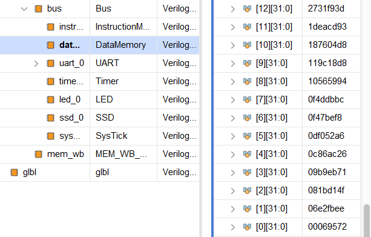

可以看待随机数正确地完成了排序。


看一下用来记录指令执行时钟周期数的 `$v0`, 值为 `0x866c`，十进制周期数为 `34412`。


## 综合情况

### 面积分析

如下图所示，总共使用了 2339 个查找表（其中 2083 个被用于逻辑， 256 个被用于存储），1820 个寄存器。

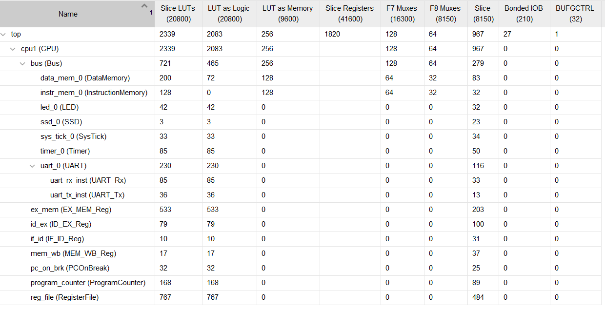


### 时序性能分析

如下图，WNS 为 2.010 ns。因此得该 CPU 理论工作频率约为 125.16 MHz。 


分析关键路径：

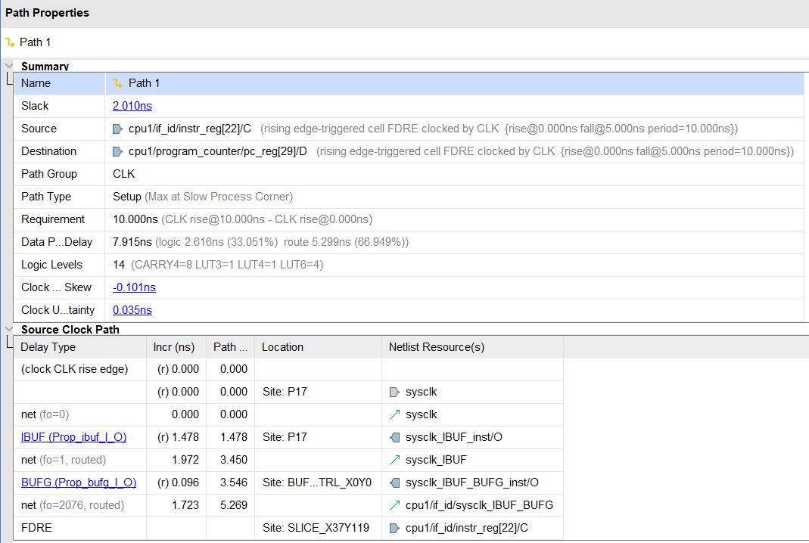

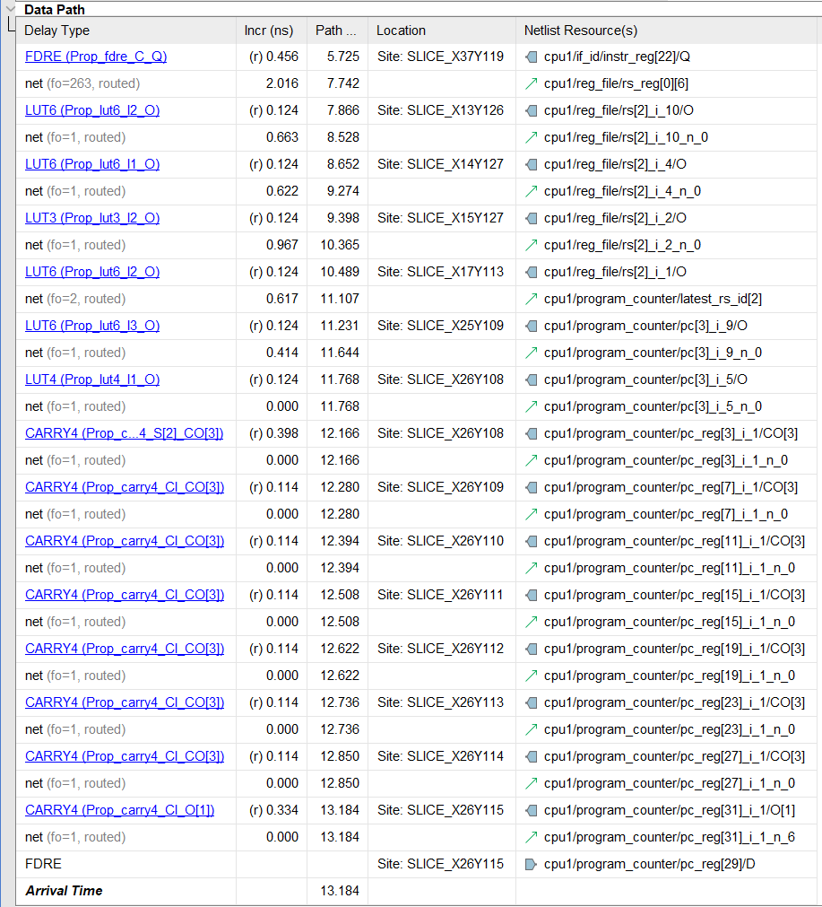

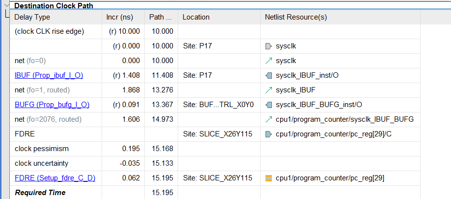


由 Data Path 可以看出，时钟上升沿来临时，先从 IF/ID 流水线寄存器获得了指令，然后从寄存器堆中读取 `rs` 寄存器，再经过转发单元控制，获得最新的 `rs`, 即 `latest_rs_id`, 然后把其值传递给 PC。因此，这应该对应 `jr` 或 `jalr` 指令的 ID 阶段。


## 硬件调试情况

得益于强大的仿真功能，在完成 CPU 逻辑功能的环节，我没有在 FPGA 板上进行过任何调试。因此在这里说一下关于仿真调试的心得。

Vivado 支持一个名为 `$readmemh` 的函数，它可以从文件中读取数据到内存型变量中。因此，只要采用 RAM 来实现 `InstructionMemory` 模块，就可以非常方便地载入不同的汇编代码进行调试。当然，这个函数也能用于向 `DataMemory` 载入数据。这样，使用不同的汇编代码和数据仿真就变得非常方便。

采用 RAM 实现 `InstructionMemory` 模块还有一个好处，就是在硬件调试时，可以配合串口，随时载入不同的汇编指令，而无需重新综合、实现、生成比特流，可以省去大量的时间。

在验证串口功能时，虽然也可以通过仿真验证，但由于当接收数据较多时需要很多周期，计算资源消耗较大，所以也需要进行必要的硬件调试。为了简化工作流程，我编写了脚本（`hex2serial.py`）实现从 Mars 生成的 16 进制机器码文本到串口序列数据的转换。

最后做排序代码的调试的时候，我也专门编写了生成随机数的脚本（`rnd_num_gen.py`）。由于串口发回的数据可读性不好，我还编写了串口序列转 32 位无符号数的脚本（`hex_num_reader.py`）。

在实现一定的自动化之后，调试复杂度会减少不少。

此外还有一些在编写代码上的心得。首先是使用 `git` 对项目进行版本控制，这样可以随时对比或回退到之前的代码，有新的实验性想法也可以通过新开分支在其上工作，而不必担心对之前的代码造成损坏。同时，我还使用了 `VSCode` 编辑器配合 `verilator` （linter）、` iStyle Formatter` （自动格式化）等插件，让编写代码变得更加智能与舒适。该方法也被我上传到网络学堂讨论区，方便同学们使用。

最后有一个唯一遇到的硬件上的坑，就是七段数码管不能扫描得太快，否则无法正常显示。


## 性能分析

生成比特流后，烧录进 FPGA。然后将 [仿真测试中使用的排序代码与数据](#本实验排序代码测试) 通过串口发送至 CPU。

排序结束后，输出执行周期数，如下图：

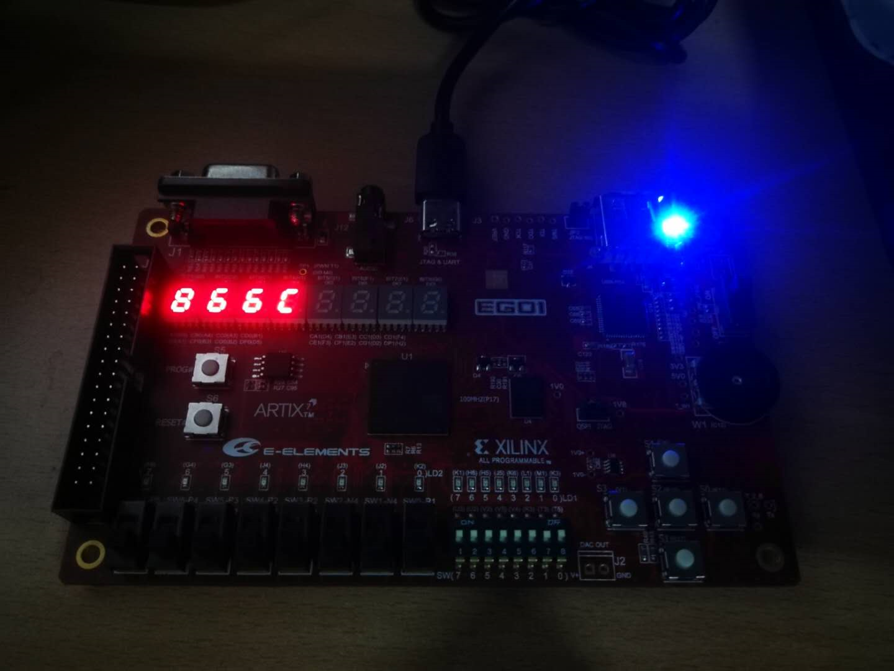


执行周期数与仿真相吻合。


启动 MARS 仿真器，使用相同的数据和代码进行测试（注：为了能在模拟器上运行，代码的初始化部分、数据读写并不相同，但排序部分完全一致）。

在排序前和排序完成的指令处下断点，通过 InstructionCounter 得到其间执行的指令情况如下图：

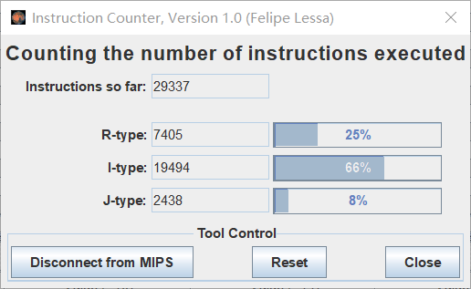


因此，有
$$
{\rm CPI}=\frac{clocks}{instr\_num}=\frac{34412}{29337}=1.173
$$
考虑 CPU 的主频为 125.16 MHz, 故平均每秒执行指令数为
$$
n=\frac{freq}{{\rm CPI}}=\frac{125.16 \ {\rm M}}{1.173}=106.70 \ {\rm M}
$$


## 思想体会

本次实验让我对 MIPS 流水线 CPU 有了更深入的了解，因为它使得我对 CPU 任何工作细节（该项目涉及的层面）都必须完全掌握。从单周期开始，一步一步地构建一个流水线 CPU：流水线寄存器、转发、冒险、中断、异常再到外设等等，步步为营。当看见烧在板子上的 CPU 能够跑着各种汇编程序时，还是非常有成就感的。

在开始本项目前，我先花了不少时间调研开发 verilog 项目的最佳环境，最终配置了一套舒适的开发工具，并且在之后的过程中，不断增加自动化小工具。事实证明，磨刀不误砍柴工。编写代码是个漫长而略微艰辛的过程，添加功能、对比性能、解决 bug，都需要投入大量的精力与思考，而这些辅助性的工作还是减轻了不少负担。

最后优化 CPU 的主频也是一个惊喜与疑惑交织的过程，好在结果还不错的样子。验收的时候，我对那块板子还有一点不舍，看来是被虐出感情了。

在最后，还是要感谢老师和助教的辛苦付出，让我们能够收获满满！


## 文件清单

要在 Vivado 2018.3 中建立该项目，只需要执行 `Tools -> Run Tcl Script...` ，选择 `mips_pipeline_cpu.tcl`。然后项目会自动生成在该目录的子文件夹 `vivado_project` 中。更多信息请查看 `README.md`。


文件清单如下：

>mips_pipeline_cpu
>├─ .gitignore
>├─ .vscode
>│    └─ settings.json
>├─ README.md
>├─ mips_pipeline_cpu.tcl
>├─ src
>│    ├─ constraints
>│    │    └─ ego1.xdc
>│    ├─ designs
>│    │    ├─ cpu
>│    │    │    ├─ ALU.v
>│    │    │    ├─ ALUControl.v
>│    │    │    ├─ BranchTest.v
>│    │    │    ├─ Bus.v
>│    │    │    ├─ CPU.v
>│    │    │    ├─ Control.v
>│    │    │    ├─ DataMemory.v
>│    │    │    ├─ ForwardControl.v
>│    │    │    ├─ HazardUnit.v
>│    │    │    ├─ InstructionMemory.v
>│    │    │    ├─ PCOnBreak.v
>│    │    │    ├─ ProgramCounter.v
>│    │    │    ├─ RegisterFile.v
>│    │    │    └─ pipeline_registers
>│    │    │           ├─ EX_MEM_Reg.v
>│    │    │           ├─ ID_EX_Reg.v
>│    │    │           ├─ IF_ID_Reg.v
>│    │    │           └─ MEM_WB_Reg.v
>│    │    ├─ external_devices
>│    │    │    ├─ LED.v
>│    │    │    ├─ SSD.v
>│    │    │    ├─ SysTick.v
>│    │    │    ├─ Timer.v
>│    │    │    ├─ UART.v
>│    │    │    ├─ UART_Rx.v
>│    │    │    └─ UART_Tx.v
>│    │    └─ top.v
>│    └─ testbenches
>│           ├─ CPU_tb_behav.wcfg
>│           ├─ CPU_tb_insertion_sort.v
>│           ├─ CPU_tb_insertion_sort_behav.wcfg
>│           ├─ CPU_with_UART_tb.v
>│           ├─ CPU_with_UART_tb_behav.wcfg
>│           ├─ DataMemory_tb.v
>│           ├─ RegisterFile_tb.v
>│           ├─ assembly
>│           │    ├─ insertion_sort.hex
>│           │    ├─ insertion_sort.s
>│           │    ├─ insertion_sort_data.hex
>│           │    ├─ timer.hex
>│           │    ├─ timer.s
>│           │    ├─ uart.hex
>│           │    ├─ uart.s
>│           │    └─ uart_data.hex
>│           └─ cpu_tb.v
>└─ utilities
>       ├─ hex2serial.py
>       ├─ hex_num_reader.py
>       └─ rnd_num_gen.py

